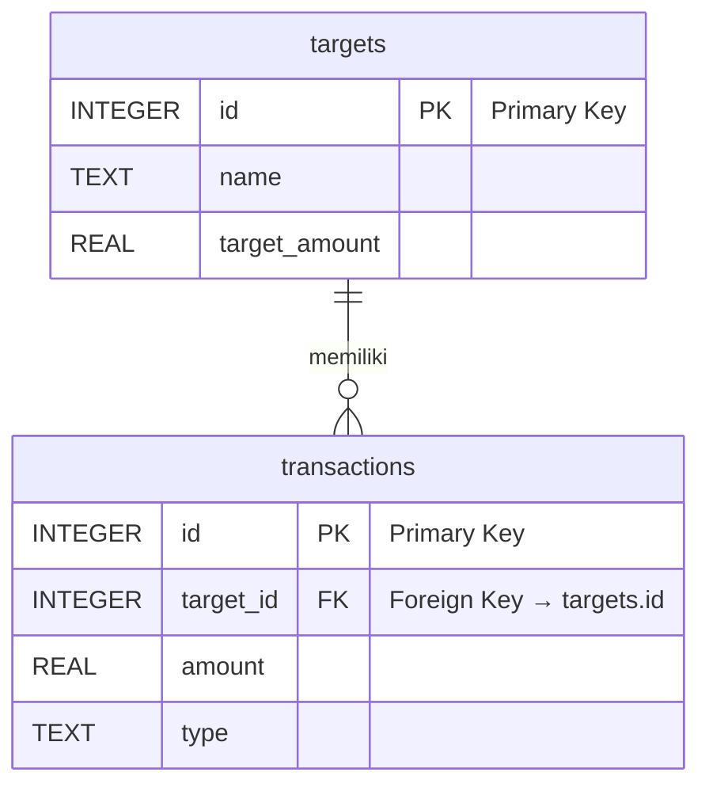

# Skema Database: TargetKu
**Versi:** 1.0
**Tanggal:** 23 Mei 2024
**Sistem Database:** SQLite (dikelola oleh Drift)

---

## 1. Ringkasan

Skema ini terdiri dari dua tabel utama:
1.  **`targets`**: Menyimpan semua data terkait target atau tujuan tabungan yang dibuat oleh pengguna.
2.  **`transactions`**: Menyimpan riwayat semua pemasukan dan pengeluaran untuk setiap target.

Relasi antara kedua tabel ini adalah **One-to-Many**: satu `Target` dapat memiliki banyak `Transaction`.

---

## 2. Tabel: `targets`

Tabel ini menyimpan informasi inti dari setiap tujuan tabungan.

| Nama Kolom        | Tipe Data (SQLite) | Constraint                | Deskripsi                                                |
| ----------------- | ------------------ | ------------------------- | -------------------------------------------------------- |
| `id`              | `INTEGER`          | `PRIMARY KEY`, `AUTOINCREMENT` | Identifier unik untuk setiap target.                     |
| `name`            | `TEXT`             | `NOT NULL`                | Nama dari barang atau tujuan yang ingin dicapai.         |
| `target_amount`   | `REAL`             | `NOT NULL`                | Jumlah total uang yang dibutuhkan untuk mencapai target.   |
| `image_url`       | `TEXT`             | `NULLABLE`                | Path lokal ke file gambar target yang disimpan di perangkat. |
| `planned_amount`  | `REAL`             | `NOT NULL`                | Nominal yang direncanakan untuk ditabung per periode.      |
| `plan_frequency`  | `TEXT`             | `NOT NULL`                | Frekuensi rencana menabung (`daily`, `weekly`, `monthly`). |
| `status`          | `TEXT`             | `NOT NULL`                | Status target saat ini (`in_progress`, `completed`).     |
| `created_at`      | `DATETIME`         | `NOT NULL`                | Timestamp kapan target ini pertama kali dibuat.          |
| `completed_at`    | `DATETIME`         | `NULLABLE`                | Timestamp kapan target ini berhasil diselesaikan.        |

**Catatan:**
*   `target_amount` dan `planned_amount` menggunakan tipe `REAL` untuk mengakomodasi nilai desimal jika diperlukan (meskipun untuk Rupiah jarang terjadi). Ini lebih aman daripada `INTEGER`.
*   `plan_frequency` dan `status` akan diimplementasikan sebagai `Enum` di level kode Dart untuk *type safety*, namun disimpan sebagai `TEXT` di database agar mudah dibaca.

---

## 3. Tabel: `transactions`

Tabel ini berisi catatan setiap aktivitas tabungan (pemasukan atau pengeluaran) yang terkait dengan sebuah target.

| Nama Kolom     | Tipe Data (SQLite) | Constraint     | Deskripsi                                                      |
| -------------- | ------------------ | -------------- | -------------------------------------------------------------- |
| `id`           | `INTEGER`          | `PRIMARY KEY`, `AUTOINCREMENT` | Identifier unik untuk setiap transaksi.                        |
| `target_id`    | `INTEGER`          | `NOT NULL`, `FOREIGN KEY` | Merujuk ke `id` pada tabel `targets` untuk mengaitkan transaksi. |
| `amount`       | `REAL`             | `NOT NULL`     | Jumlah uang dalam transaksi. Selalu positif.                     |
| `type`         | `TEXT`             | `NOT NULL`     | Jenis transaksi (`increase` untuk pemasukan, `decrease` untuk pengeluaran). |
| `description`  | `TEXT`             | `NULLABLE`     | Catatan atau deskripsi opsional untuk transaksi.               |
| `date`         | `DATETIME`         | `NOT NULL`     | Tanggal dan waktu kapan transaksi ini dicatat.                 |

**Catatan:**
*   `target_id` adalah kunci utama yang menghubungkan setiap transaksi ke target induknya.
*   `amount` selalu disimpan sebagai nilai absolut (positif). Logika penambahan atau pengurangan saldo akan ditangani di level aplikasi berdasarkan kolom `type`.

---

## 4. Relasi Antar Tabel

### Diagram Relasi

*   **Jenis Relasi:** One-to-Many.
*   **Keterangan:**
    *   Satu baris di tabel `targets` dapat berelasi dengan banyak baris di tabel `transactions`.
    *   Setiap baris di tabel `transactions` harus berelasi dengan tepat satu baris di tabel `targets`.
*   **Implementasi Query:** Untuk menghitung total tabungan terkumpul untuk sebuah target, kita akan melakukan query `SUM(amount)` pada tabel `transactions` di mana `target_id` cocok dan `type` adalah `increase`, lalu dikurangi `SUM(amount)` di mana `type` adalah `decrease`.

---